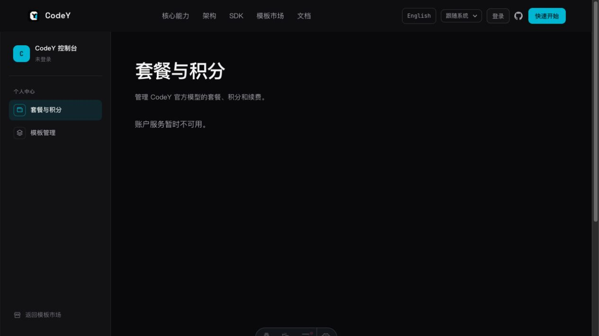
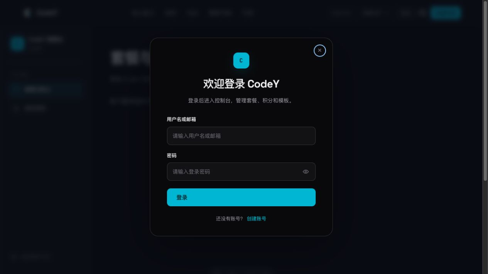
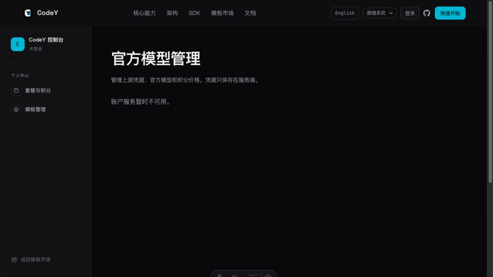
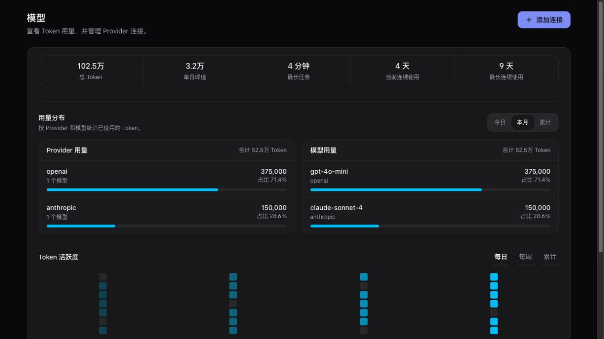
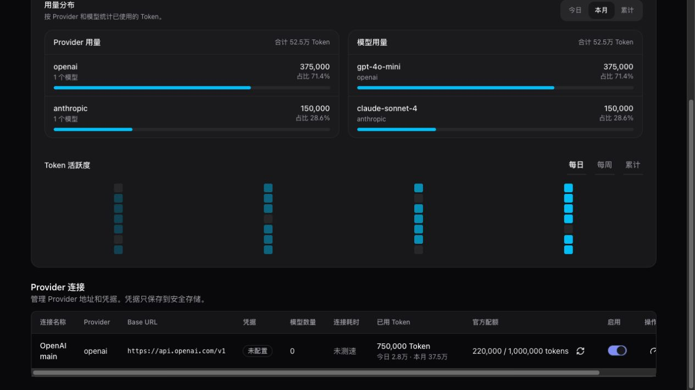
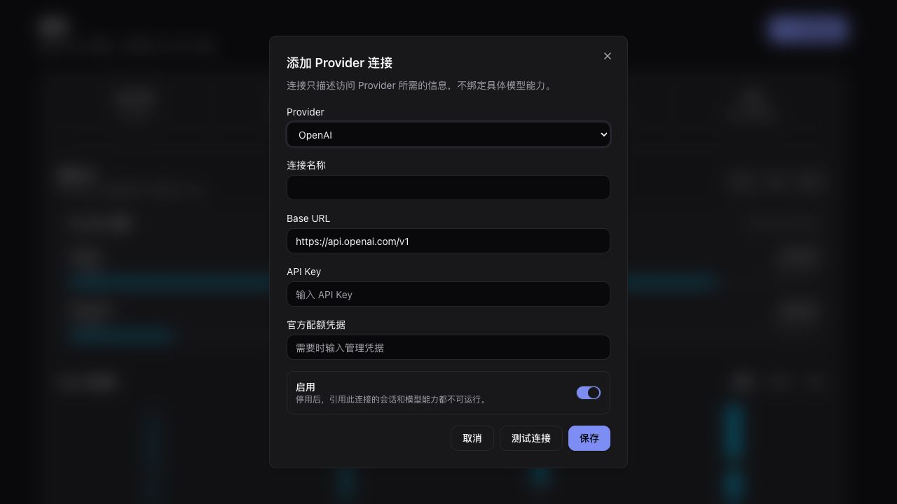

# CodeY 官网模型、套餐与积分体验审计

日期：2026-07-29

## 结论

问题的根源不是卡片样式，而是四类页面没有分层：

1. 公开展示页：访客了解模型与套餐。
2. 用户账单页：已登录用户查看当前套餐、积分和订单。
3. 模型后台：管理员接入 Provider、发现模型、配置价格和能力。
4. 套餐后台：管理员编排套餐、模型权益、积分和支付报价。

当前 `/console/` 同时承担用户账户、套餐销售和积分包销售；`/console/models/` 同时承担 Provider、模型、套餐和积分包管理。页面职责过多，权限、数据加载和操作状态也互相牵连。

## 审计步骤

### 1. 官网首页与顶部导航

健康度：需重构


- 顶部没有“模型”和“套餐”入口。访客只能从登录或控制台进入商业功能。
- 当前已有五个主导航项，再平铺两个入口会拥挤。应把“核心能力 / 架构 / SDK”收进“产品”，保留“模型 / 套餐 / 模板市场 / 文档”四个一级入口。
- “快速开始”继续承担产品上手，不应兼任购买入口。

### 2. 未登录访问套餐与积分

健康度：阻塞



- 访客进入的是控制台，不是套餐展示页。
- 套餐目录、积分包、账户信息在同一个加载事务中。任一接口失败，全部内容隐藏。
- 捕获环境只显示“账户服务暂时不可用”，没有重试、登录或返回套餐展示页的动作。
- 控制台页包含全站页脚，页面很长时会削弱后台应用的结构感。

### 3. 登录校验

健康度：部分可用



- 登录弹窗结构完整，有明确标签、密码显示控制和注册入口。
- 购买意图没有被保存。用户从套餐卡点击购买后登录，当前实现只能重新加载账户，不能恢复“购买哪个套餐、哪个报价”。
- GitHub 登录的 continuation 只处理 Desktop OAuth。套餐购买需要独立的安全 return-to / purchase-intent 机制。

### 4. 未登录访问模型后台

健康度：阻塞



- URL 可以直接访问，但页面只显示服务错误。
- 未登录用户不该进入管理员模型页。路由层应明确区分公开模型目录与管理员模型后台。
- “官方模型管理”页内部还包含套餐和积分包，标题与实际职责不一致。

### 5. CodeY 桌面端模型管理参考

健康度：可复用



- 桌面端把用量、Provider 和模型状态放在可观测的表格中。
- Provider、模型和用量有明确关系，可看到模型数量、连接耗时、凭据、配额和启停状态。
- 官网管理员不需要复制 Token 用量大盘，但应复用“连接是一级实体”的信息模型。

### 6. CodeY Provider 连接表

健康度：可复用，需收敛列数



- 连接列表适合管理员批量管理。
- 官网可保留：连接名称、Provider、Base URL、凭据状态、模型数量、最近测试、启用、操作。
- Token 用量和官方配额不是官网上游连接管理的必要列，可放进详情抽屉。

### 7. CodeY 新增 Provider 连接

健康度：可复用



- “选择 Provider → 自动填入 Base URL → 输入凭据 → 测试连接 → 保存”是一条完整主线。
- 官网应在测试成功后继续展示发现到的模型，并允许批量导入。当前官网只保存 Provider，模型仍要手工逐个录入。

## 推荐信息架构

| 受众 | 路由 | 页面职责 |
| --- | --- | --- |
| 公开 | `/models/` | 官方模型目录、能力、积分价格、可用套餐 |
| 公开 | `/pricing/` | 套餐比较、积分包、规则说明、购买入口 |
| 用户 | `/console/` | 账户概览、余额、当前套餐、到期时间 |
| 用户 | `/console/billing/` | 续费、升级、降级、订单与支付状态 |
| 用户 | `/console/credits/` | 积分构成、消耗明细、到期批次 |
| 管理员 | `/console/models/` | Provider 连接与官方模型 |
| 管理员 | `/console/plans/` | 套餐版本、模型权益和支付报价 |
| 管理员 | `/console/credit-packs/` | 永久积分包 |

管理员模型页可用页内 Tab 分成“Provider 连接”和“官方模型”。管理员套餐页可用页内 Tab 分成“套餐”和“积分包”。不再把四张长表单纵向堆在一个页面。

## 公开模型页

桌面端使用表格，移动端使用卡片。

顶部只放搜索和高频筛选：

- Provider / 模型系列
- 输入模态：文本、图片
- 能力：工具调用、推理、结构化输出、缓存
- 可用套餐

表格字段：

- 模型名称和公开 Model ID
- Provider 品牌
- 上下文窗口与最大输出
- 能力标签
- 输入 / 输出 / 缓存积分价格
- 可用套餐
- 详情

详情抽屉展示完整能力、协议、价格版本、套餐覆盖和调用示例。公开接口不能返回上游 Base URL、上游 Model ID 或凭据状态。

## 公开套餐页

页面顺序：

1. 标题与一句积分说明。
2. 套餐卡片。
3. 模型覆盖对比表。
4. 一次性积分包。
5. 续费、升级、降级、积分到期和扣减顺序说明。

套餐卡片应显示：

- 本地区域的主价格
- 每自然月积分
- 包含模型数量或模型组
- 三到五条真实权益
- 当前套餐 / 推荐 / 下期生效状态
- 单一主按钮

不要为微信、支付宝、Stripe 分别生成整行购买按钮。卡片只保留“购买 / 升级 / 续费”。支付方式放入确认弹窗。

当前后端只支持自然月，不应先加入月付 / 年付切换。

## 购买交互

```text
点击购买
  ├─ 未登录：记录 purchase intent → 打开登录弹窗
  │            └─ 登录成功：恢复确认弹窗，不自动下单
  └─ 已登录：读取当前套餐 → 显示价格与生效规则 → 选择支付方式 → 创建订单
```

purchase intent 只保存商品类型、商品 ID、offer ID 和当前页面。不要保存凭据或支付数据。

确认弹窗必须解释本次操作的结果：

- 新购：立即生效，显示周期结束时间。
- 升级：显示补差金额和立即生效。
- 续费：显示从当前周期结束后生效。
- 降级：不进入支付，确认下期套餐。

支付完成后显示明确结果页或状态区，不只依赖轮询后刷新原页面。

## 用户套餐与积分

“套餐”与“积分”是两个概念：

- 套餐决定每期获得多少积分、能使用哪些模型。
- 积分是消耗单位，分套餐积分和永久积分。

账户概览只保留四项：

- 可用积分
- 当前套餐
- 有效期
- 下期变更

“已预留”属于结算内部状态，改成“处理中积分”，并提供说明。积分明细页按批次展示来源、剩余、到期时间和扣减记录。

当前服务只有钱包汇总，没有积分流水、订单列表和用量估算接口。这些功能不能只靠前端补齐。

## 管理员模型页

### Provider 连接

列表字段：

- 连接名称
- Provider 类型
- Base URL
- 凭据状态
- 已接入模型数
- 最近测试结果与延迟
- 启用状态

新增连接使用右侧抽屉或弹窗：

1. 选择 Provider 模板。
2. 自动填入默认 Base URL。
3. 输入连接名与 API Key。
4. 测试连接。
5. 展示发现到的模型。
6. 选择并批量导入。

### 官方模型

列表字段：

- 公开 Model ID
- 上游连接与上游 Model ID
- 协议
- 能力
- 积分价格
- 覆盖套餐
- 状态

编辑放入抽屉，分成“标识 / 能力 / 价格 / 可见性”四组。价格发布前显示变更摘要。停用模型时先检查套餐引用。

## 管理员套餐页

套餐列表先展示版本、价格、积分、模型覆盖、状态和发布时间。编辑放入独立工作区：

1. 基本信息。
2. 月积分。
3. 可用模型。
4. 其他权益和限制。
5. 地区、币种与支付报价。
6. 预览。
7. 发布。

当前接口把保存等同于发布。建议增加 `draft / published / archived`，避免管理员每次编辑都生成线上版本。

当前 `PlanBenefit.limit` 是通用 JSON，但界面只暴露模型复选框。套餐页需要按权益类型渲染结构化限制，不让管理员直接编辑 JSON。

## 现有能力与缺口

已有能力：

- `/plans`、`/top-ups` 是公开读取接口。
- 套餐和模型价格都有版本。
- 套餐支持多地区、币种和支付渠道报价。
- 套餐权益可以关联模型。
- 上游支持 OpenAI-compatible、Anthropic 和 Gemini。
- 上游密钥加密保存在服务端。

需要补充：

- 公开模型目录接口。现有 `/models` 要求登录，并按用户套餐过滤。
- Provider 连接测试与健康状态。
- Provider 模型发现和批量导入。
- 模型与套餐的反向引用检查。
- 套餐草稿、预览、发布和归档状态。
- 积分流水、订单列表、退款和支付失败后的恢复入口。
- 购买 intent 在登录前后的恢复。
- 分区独立加载和错误恢复。

## 可访问性风险

- 动态加载和支付状态没有 `aria-live`，屏幕阅读器可能不知道状态已变化。
- 支付弹窗关闭按钮在中文页仍使用英文 `aria-label="Close"`。
- 服务错误只有文本，没有 `role="alert"`、重试按钮或对应动作。
- 灰色辅助文字在深色背景上的对比度需要实际测量。
- 本次未完成有效的移动端截图校验，也未验证键盘焦点顺序、缩放重排和完整 WCAG 符合性。

## 实施顺序

1. 新增公开 `/models/` 与 `/pricing/`，调整顶部导航。
2. 拆开公开目录加载与登录账户加载。
3. 完成购买登录校验、intent 恢复和购买确认。
4. 拆分 `/console/models/` 与 `/console/plans/`。
5. 接入 Provider 测试、模型发现和批量导入。
6. 增加积分流水、订单与套餐发布状态。

